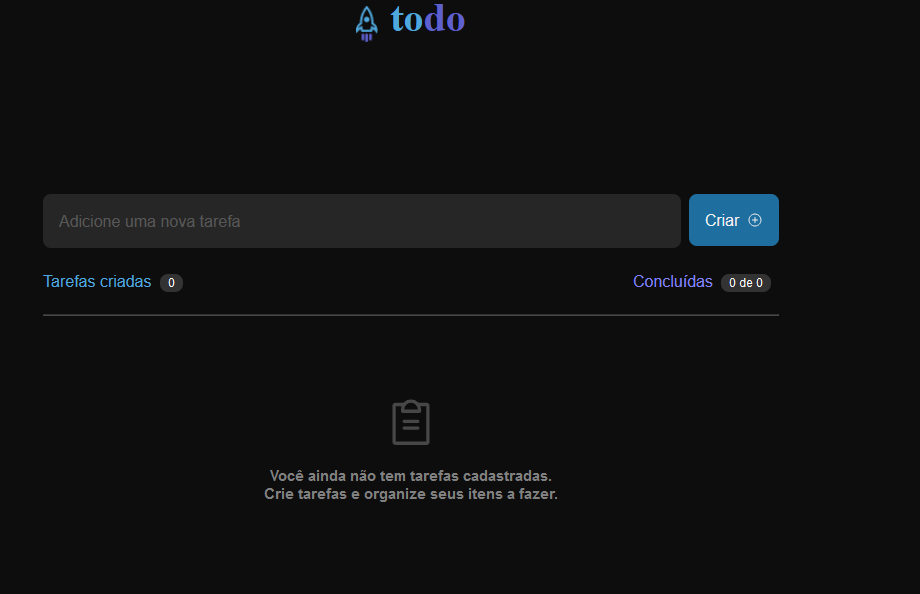
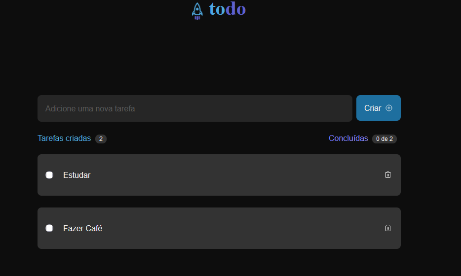
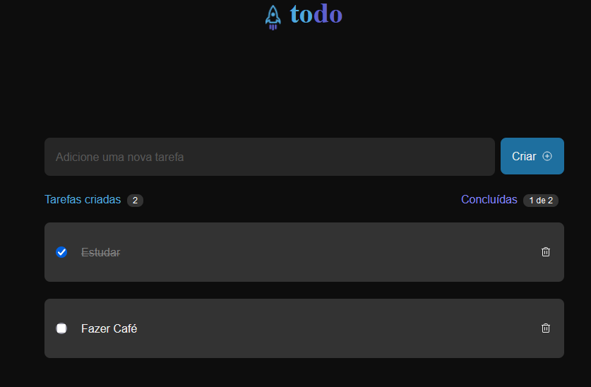

# ToDo - RocketSeat 🚀

Um projetinho TodoList feito com React e TypeScript, faz parte dos desafios do curso Ignite da RocketSeat.

# 1. Tecnologias 💻:

-   TypeScript 🔷
-   React ⚛️
-   Vite ⚡

# 2. Executando o projeto ▶️

1. Faça o clone deste repositório 🔄:

```
https://github.com/Marcelo-Lecampos/toDo.git
```

2. Instale as dependências 📦:

```
npm install
```

3. Execulte 📦:

```
npm run dev
```

# 3. Imagens 📸:

<div>
  <h3>🏠 Tela Inicial:</h3>
  
</div>

<div>
  <h3>➕ Adicionado dois toDos:</h3>
  
</div>

<div>
  <h3>✅ Marcando um toDo como finalizando:</h3>
  
</div>

<div>
  <h3>🗑️ Removendo um toDo:</h3>
  
</div>

